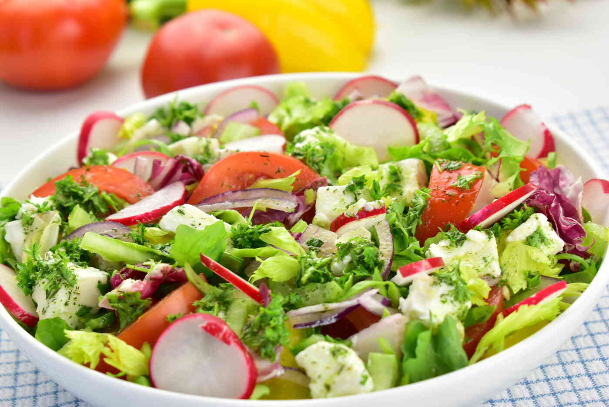

# TEAM
1. Kamila Pęgiel:
   - Git Account Name: bamqus
   - Task Number: 3 , 4
3. Aleksandra Rzemińska
   - Git Account Name: AleksandraRzeminska
   - Task Number: 1 , 2
4. Anna Konopka
   - Git Account Name: Luc15l
   - Task Number: 5 , 6

# WPROWADZENIE  
Jedzenie i picie to bardzo ważna część ludzkiego życia.     
 Ludzie bez jedzenia i picia umierają, więc ważne jest by jeść wystarczająco kalori codzienne żeby przeżyć i zdrowo funkcjować.   
 Niektóre osoby też mają własne preferencje co do jedzenia które lubią jeść i wolą je kupować zamiast innych produktów sporzywczych

# DANE
W tej tabeli jest pokazana kaloryczność różnego jedzenia i napoi. Jest ona potrzebna dla ludzi którzy chcą wiedzieć ile kalori jedzą.  
| Nazwa | Ilość kcal w 100g | Ilość w małej porcji 50g | Ilość kcal w dużej porcji 200g |  
|------|----|---|---|
|Frytki|140|70|280|  
|Cola zero|2|1|4|
|Hamburger|250|125|50|
|Sałatka|50|25|100|
# OBRAZY

